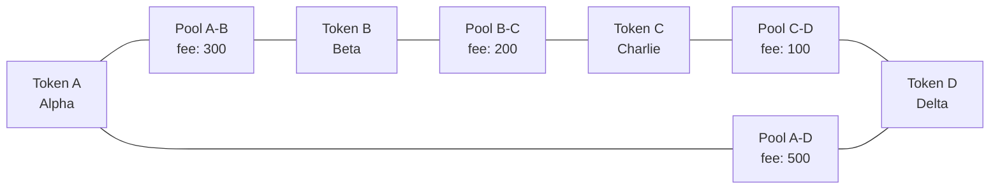

# DEX Project with Hardhat

This project implements a Decentralized Exchange (DEX) with Pool and Router contracts using Hardhat. It includes contracts for token swapping, liquidity provision, and factory deployment.

## Prerequisites

- Node.js (v14+ recommended)
- npm or yarn

## Setup

1. Clone the repository:

```shell
git clone <repository-url>
cd hardhat
```

2. Install dependencies:

```shell
npm install
```

## Available Commands

```shell
# Get help with Hardhat commands
npx hardhat help

# Run tests
npx hardhat test

# Run tests with gas reporting
REPORT_GAS=true npx hardhat test

# Start a local Ethereum node
npx hardhat node

# Deploy the Lock contract using Ignition
npx hardhat ignition deploy ./ignition/modules/Lock.js

# Deploy multiple pools
npx hardhat run scripts/deploy_multiple_pools.js

# Add liquidity to pools
npx hardhat run scripts/add-liquidity.js

# Interact with deployed pools
npx hardhat run scripts/interact_with_pools.js
```

## Project Structure

- `contracts/`: Smart contracts
  - `Router.sol`: Main router contract for token swaps
  - `Pool.sol`: Liquidity pool implementation
  - `PoolFactory.sol`: Factory for creating new pools
  - `LPToken.sol`: Liquidity provider token
  - `NewToken.sol`: ERC20 token implementation
  - `Lock.sol`: Sample contract

- `scripts/`: Deployment and interaction scripts
- `test/`: Test files for smart contracts
- `hardhat.config.js`: Hardhat configuration

## Configuring Networks

The project is configured to work with:
- Local Hardhat Network (chainId: 31337)
- Localhost (http://127.0.0.1:8545)

## pool config


